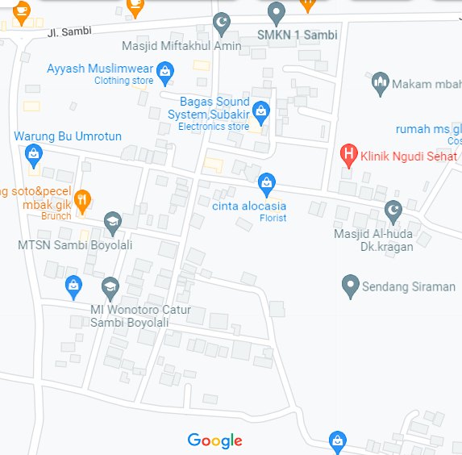
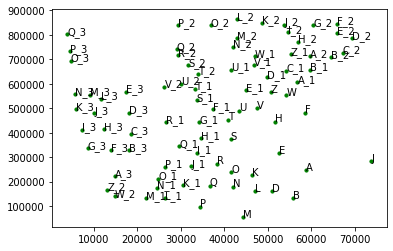

# TSP_genetic_algorithm
The genetic algorithm is a heuristic based search algorithm
on the mechanisms of natural selection and natural genetics. The basic concept
 inspired the emergence of the genetic algorithm is the theory of natural evolution
proposed by Charles Darwin. In this theory it is explained that on
natural evolutionary process, each individual must adapt to
the surrounding environment in order to survive (Kurnia et al., n.d.).

Genetic algorithms may not always achieve the best results, however
often solves the problem quite well. Genetic Algorithm
represents a solution to a problem as a chromosome. There is
Some important aspects in genetic algorithms include function definition
fitness, definition and implementation of genetic representation, definition and
implementation of genetic operations (Suprayogi & Mahmudy, n.d.).
D.E. Golberg in his book uses the Genetic Algorithm method
in solving optimization problems in the industry. GA method then
developed its use in various fields of science, one of them
applied in optimization of distribution network design (Budiastra et al., 2006).
The genetic algorithm in this case is almost similar to the Traveling case
Salesman Problem (TSP).

# Methode
## 1. Location
The floor plan or location representation is taken from Google Map imaging
for Wonotoro village. Sendang Siraman is on the right side of Hamlet
Wonotoro. Below is a picture of a house plan
marked with red nodes and water springs marked with
the cross marks as the potential for EBT Microhydro, while the red line is
a line that limits the area of the Wonotoro village itself

 
 
  
## 2. Coordinate Determination
From data, the number of active houses is 86.
so there are 86 nodes that need to be connected. formed nodes
then transformed into Cartesian coordinates with
Geogebra which can be accessed online at https://www.geogebra.org/m/JMMKv7cx

 

So when plotted, you will get the image model below, with
node J as the location of Sendang Siraman (Water Spring).

## 3. Calculation of the distance of each node
Calculation of fitness is needed for the needs of the Algorithm
Genetics to find the best solution. Calculation of the distance between nodes
doing with the Euclide Distance Formula and the results are stored
into a matrix. Euclidean Distance Geometry is the study of
Euclidean geometry based on the concept of distance. Euclidian distance is useful
in some applications where the input data consists of a collection of distances, and
the output is the set of points in Euclidean space that gives
actual distance values (Liberti et al., 2014).

